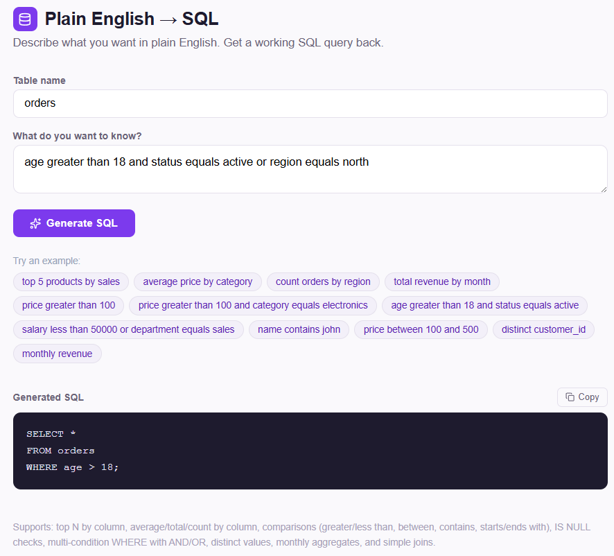

# 🔍 Plain English → SQL Query Builder

A browser-based tool that converts plain English descriptions into working SQL queries. No need to remember exact syntax — just describe what you want and get a clean, ready-to-use SQL statement instantly.

🌐 **Live:** [daemontargaryen47.github.io/sql-query-builder](https://daemontargaryen47.github.io/sql-query-builder/)

---

## 📸 Screenshot



---

## ✨ Features

- **Natural language to SQL** — describe your query in plain English
- **Multi-condition WHERE clauses** — combine conditions with AND / OR
- **Pattern support:**
  - Top N by column — `top 5 products by sales`
  - Aggregations — `average price by category`, `total revenue by month`
  - Comparisons — `price greater than 100`, `age less than 30`
  - Range — `price between 100 and 500`
  - Text search — `name contains john`, `email starts with admin`
  - NULL checks — `email is null`, `phone is not null`
  - Distinct values — `distinct customer_id`
  - Monthly aggregates — `monthly revenue`
  - Simple joins — `join orders and customers on customer_id`
- **Multi-condition support** — `price greater than 100 and category equals electronics`
- **Custom table names** — adapts all queries to your actual table
- **Copy to clipboard** with one click
- **Query history** — revisit your last 5 generated queries
- **Example queries** — one-click examples to get started instantly

---

## 🛠️ Built With

- [React](https://reactjs.org/)
- [Lucide React](https://lucide.dev/) — icons
- Regex-based natural language parsing
- [GitHub Pages](https://pages.github.com/) — hosting

---

## 🚀 Run Locally

```bash
git clone https://github.com/DaemonTargaryen47/sql-query-builder.git
cd sql-query-builder
npm install
npm start
```

Open [http://localhost:3000](http://localhost:3000) in your browser.

---

## 📦 Deploy to GitHub Pages

```bash
npm run deploy
```

---

## 💡 How It Works

The app uses regex-based pattern templates to match common analytical phrasing and maps each to a corresponding SQL structure. Multi-condition inputs are split on `AND` / `OR` keywords, each segment is parsed independently, and the resulting clauses are joined into a single `WHERE` statement.

---

## 🔮 Planned Improvements

- HAVING clause support for filtered aggregations
- Subqueries and nested logic
- LLM integration for fully flexible natural language understanding

---

## 👤 Author

**Chowdhury Aseer Ruthbah**
[GitHub](https://github.com/DaemonTargaryen47) • [LinkedIn](https://www.linkedin.com/in/chowdhury-aseer-ruthbah-0a9ba9275)
